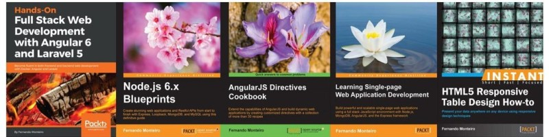

  <h1 style="text-align: center">
    
      Fernando Barba Developer
    
  </h1>
  

    I'm Senior Software developer with 20+ years of professional experience, <a href="https://www.packtpub.com/authors/fernando-monteiro" target="_blank">@packtpub</a> author and working fulltime with TypeScript and <a href="https://www.amazon.com/Fernando-Monteiro/e/B00J73VOHO" target="_blank">Angular</a>.
  

### My books

---

- 💻 I’m currently working on [@mendelics](https://github.com/mendelics) as Front-end engineer.
- 💼 My past jobs include but are not limited to companies like: PagBank, PagSeguro, Biva, Siss Saúde.
- 📫 How to reach me: check my [blog](https://barbadev.netlify.app/)

|  |  |
| --------------------------------------------------------------------------------------------------------------------------------------------------------------------------------------------------------------------- | ------------------------------------------------------------------------------------------------------------------------------------------------------- |
